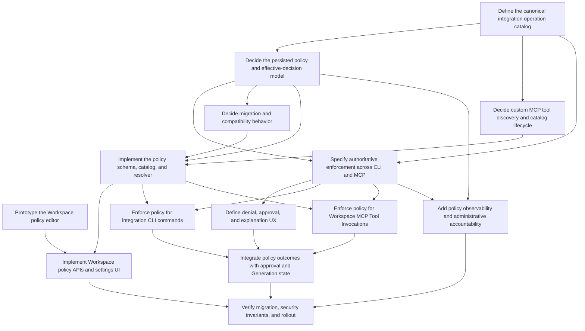

# Linear-ready Wayfinder bundle: Workspace integration operation policy

This file stages the map and child-issue text for Linear. It is not the canonical
tracker state until the issues are created under team `cmdlaw`.

## Map issue

### Title

Deliver Workspace integration operation policies

### Labels and status

- Label: `wayfinder:map`
- Status: Backlog

### Body

## Destination

Specify, implement, migrate, verify, and roll out a Workspace-scoped policy that
governs every operation exposed by managed integrations and custom Workspace MCP
Servers across both integration CLI and MCP execution.

Workspace owners and admins can set an Integration Type or custom Workspace MCP
Server to `Auto-approved`, `Requires approval`, `Denied`, or `Personalized`.
`Personalized` starts fully auto-approved and permits individual operations to be
restricted to `Requires approval` or `Denied`.

## Notes

- This map explicitly carries execution through rollout; it does not stop at a
  specification.
- Use the canonical Bap terms in `CONTEXT.md`: Workspace, Integration Type,
  Workspace MCP Server, Platform MCP Server, Tool Invocation, Generation, and
  Connected Account.
- One policy applies to every Connected Account of an Integration Type in the
  Workspace.
- Managed integration CLI commands and equivalent MCP tools share one canonical
  operation identity and one policy decision.
- Custom Workspace MCP Servers are in scope and are keyed by stable server
  identity plus discovered tool identity.
- Platform MCP Servers, including the Bap MCP Server, are excluded completely.
- Existing and newly introduced integrations and operations default to
  `Auto-approved`.
- `Denied` is authoritative and terminal. A denied parent denies everything
  beneath it, and neither chat nor Coworker auto-approval can bypass it.
- `Requires approval` is bypassed by the existing per-Generation
  `autoApprove` input. Chat and Coworker behavior is identical: the User's
  blanket auto-approval is treated as consent.
- An operation marked `Auto-approved` runs automatically even when the current
  chat or Coworker has auto-approval disabled.
- Operation-level customization only restricts. It cannot make an operation
  more permissive than its parent.
- Denied operations remain visible to the model. Attempts are rejected
  authoritatively with a structured Workspace-policy denial that the model and
  UI can explain to the User.
- Workspace owners and admins may edit policy. Workspace members may view the
  effective policy.
- Existing ADR-0013 remains unchanged because Platform MCP Servers are out of
  scope.
- Relevant current paths include:
  - `apps/sandbox/src/common/plugins/integration-permissions.ts`
  - `packages/core/src/server/ai/permission-checker.ts`
  - `packages/core/src/server/runtime/opencode/opencode-runtime-approvals.ts`
  - `packages/core/src/server/execution/pre-prompt-assets.ts`
  - `packages/db/src/schema/tables-integration.ts`
  - `apps/web/src/routes/toolbox/`
  - `apps/web/src/lib/integration-icons.ts`
  - `apps/web/src/lib/parse-cli-command.ts`

## Decisions so far

<!-- Empty until child tickets are resolved. -->

## Not yet specified

- Whether policy changes need durable product history beyond ordinary
  observability and database timestamps.
- How long removed or temporarily unavailable custom MCP tools remain visible
  in the policy editor.
- Whether future parameter-sensitive restrictions deserve a separate policy
  system after operation-level enforcement ships.

## Out of scope

- Platform MCP Servers, including every Bap MCP Server tool.
- Arbitrary shell, filesystem, browser, or OpenCode runtime permissions.
- Per-Connected-Account policy variants.
- Per-member policy variants.
- Allowing a child operation to bypass a denied or more restrictive parent.
- Parameter-, recipient-, record-, field-, or payload-sensitive rules.

---

## Child ticket: Define the canonical integration operation catalog

### Type, labels, and status

- Type/label: `wayfinder:task`
- Triage: ready-for-agent
- Status: Todo
- Blocking: none

### Body

## Question

What stable canonical identity and metadata contract will represent the same
integration operation across the current CLI parser, approval projection, MCP
tool definition, policy UI, and persisted Workspace policy?

## Context

Operation knowledge is currently duplicated across
`apps/sandbox/src/common/plugins/integration-permissions.ts`,
`packages/core/src/server/ai/permission-checker.ts`,
`apps/web/src/lib/integration-icons.ts`, CLI implementations under
`apps/sandbox/src/common/skills/`, and MCP tool annotations under
`apps/mcp/servers/*/src/tools/`.

## Acceptance criteria

- Inventory every managed Integration Type and its current CLI operations.
- Inventory managed and custom Workspace MCP tool identity sources.
- Define a stable canonical operation key and display metadata.
- Define how CLI commands and MCP tools map to the same key.
- Define collision, rename, removal, and unknown-operation behavior.
- Confirm Platform MCP tools cannot enter the catalog.
- Produce an implementable catalog contract and migration notes.

---

## Child ticket: Prototype the Workspace policy editor

### Type, labels, and status

- Type/label: `wayfinder:prototype`
- Triage: ready-for-human
- Status: Todo
- Blocking: none

### Body

## Question

What Workspace settings experience makes four integration-level modes and
operation-level restrictions understandable and safe for admins while keeping
the full operation catalog reviewable by members?

## Context

The supplied Claude permissions screenshot is the interaction reference, not a
pixel specification. The Bap model differs because `Personalized` is the only
mode that enables per-operation restriction, and denied operations remain
visible to the model.

## Acceptance criteria

- Produce a clickable or code-backed rough prototype in Bap's existing design
  language.
- Cover managed Integration Types and custom Workspace MCP Servers.
- Show the four modes: `Auto-approved`, `Requires approval`, `Denied`, and
  `Personalized`.
- In `Personalized`, allow each operation to remain auto-approved or become
  approval-required or denied.
- Make terminal parent denial and current defaults unambiguous.
- Show member read-only and admin editable states.
- Show newly discovered, unavailable, renamed, and removed operations.
- Resolve the preferred settings route and bulk-edit interactions with the
  User before closing.

---

## Child ticket: Decide the persisted policy and effective-decision model

### Type, labels, and status

- Type/label: `wayfinder:grilling`
- Triage: ready-for-human
- Status: Blocked
- Blocking: Define the canonical integration operation catalog

### Body

## Question

What normalized Workspace-owned data model and pure resolution algorithm encode
the four parent modes, personalized operation restrictions, implicit
auto-approved defaults, admin authorization, and per-Generation `autoApprove`
precedence?

## Acceptance criteria

- Specify tables, keys, constraints, relations, and deletion behavior.
- Keep Integration Type policy independent of Connected Account.
- Key custom server policy by stable Workspace MCP Server identity.
- Avoid creating a row for every auto-approved default unless justified.
- Specify the effective-decision truth table:
  terminal denial; Generation auto-approval; policy auto-approval; otherwise
  approval required.
- Specify behavior for missing, unknown, renamed, removed, and rediscovered
  operations.
- Specify concurrency and atomic update behavior for personalized policies.
- Define read authorization for members and write authorization for Workspace
  owners/admins.

---

## Child ticket: Decide custom MCP tool discovery and catalog lifecycle

### Type, labels, and status

- Type/label: `wayfinder:grilling`
- Triage: ready-for-human
- Status: Blocked
- Blocking: Define the canonical integration operation catalog

### Body

## Question

How will Bap discover, persist, refresh, and present the tools of a custom
Workspace MCP Server without making runtime availability the authority for
policy identity?

## Acceptance criteria

- Choose the authoritative stable identity for custom MCP tools.
- Define discovery timing, refresh, retry, and failure behavior.
- Preserve admin intent through server reconnects and tool-list reordering.
- Define rename/removal/rediscovery behavior.
- Keep all newly discovered tools auto-approved by default.
- Ensure an unavailable server or failed discovery does not erase policy.
- Identify what remains fog for long-term catalog retention/history.

---

## Child ticket: Specify authoritative enforcement across CLI and MCP

### Type, labels, and status

- Type/label: `wayfinder:grilling`
- Triage: ready-for-human
- Status: Blocked
- Blocking:
  - Define the canonical integration operation catalog
  - Decide the persisted policy and effective-decision model

### Body

## Question

At which trusted boundaries must the effective Workspace policy be evaluated so
CLI and MCP paths share semantics, cannot bypass each other, and remain correct
in Bap's stateless runtime architecture?

## Acceptance criteria

- Trace managed integration CLI execution end to end.
- Trace managed and custom Workspace MCP Tool Invocations end to end.
- Choose authoritative server-side enforcement points for both paths.
- Treat sandbox/plugin checks as defense in depth, not the source of truth.
- Keep denied tools exposed to the model while guaranteeing execution rejection.
- Define structured allow, approval-required, and policy-denied outcomes.
- Ensure stale sessions and reused sandboxes cannot retain obsolete policy.
- Define behavior when policy changes during a pending approval or active
  Generation.

---

## Child ticket: Define denial, approval, and explanation UX

### Type, labels, and status

- Type/label: `wayfinder:prototype`
- Triage: ready-for-human
- Status: Blocked
- Blocking: Specify authoritative enforcement across CLI and MCP

### Body

## Question

How should the runtime, conversation UI, CLI, Coworker Run backlog, and model
represent a Workspace-policy denial versus an approval request or a User denial?

## Acceptance criteria

- Define one structured policy-denial contract with integration, operation,
  Workspace, and safe reason metadata.
- Ensure policy denial never creates a pending approval.
- Ensure `Requires approval` continues through the current durable approval
  lifecycle.
- Ensure the model receives enough information to explain the restriction and
  suggest contacting a Workspace admin.
- Provide clear web and CLI copy without leaking credentials or sensitive tool
  input.
- Distinguish Workspace policy denial, User denial, missing authorization, and
  unavailable MCP server.
- Cover manual chats, manual Coworker Runs, and automated Coworker Runs.

---

## Child ticket: Decide migration and compatibility behavior

### Type, labels, and status

- Type/label: `wayfinder:grilling`
- Triage: ready-for-human
- Status: Blocked
- Blocking: Decide the persisted policy and effective-decision model

### Body

## Question

How will the new implicit auto-approved Workspace policy coexist with and then
replace coarse read/write inference without breaking the existing chat and
Coworker `autoApprove` contract?

## Acceptance criteria

- Existing and newly introduced operations resolve to auto-approved by default.
- Existing chat and Coworker `autoApprove` inputs remain supported.
- An explicit policy `Auto-approved` operation runs even when `autoApprove` is
  false.
- `autoApprove` bypasses `Requires approval` but never `Denied`.
- Define whether and when existing read/write metadata remains useful as
  descriptive catalog metadata.
- Define a safe deployment order for schema, reads, writes, enforcement, and UI.
- Define rollback behavior that cannot turn an explicit denial into execution.

---

## Child ticket: Implement the policy schema, catalog, and resolver

### Type, labels, and status

- Type/label: `wayfinder:task`
- Triage: ready-for-agent
- Status: Blocked
- Blocking:
  - Decide the persisted policy and effective-decision model
  - Decide custom MCP tool discovery and catalog lifecycle
  - Decide migration and compatibility behavior

### Body

## Question

Implement the durable Workspace policy, canonical operation catalog, custom MCP
catalog lifecycle, authorization checks, and pure effective-decision resolver.

## Acceptance criteria

- Add colocated unit tests for the complete precedence truth table.
- Add database schema and relations using the repo migration workflow.
- Enforce owner/admin writes and member reads server-side.
- Implement canonical CLI/MCP operation mapping without duplicated divergent
  registries.
- Support custom Workspace MCP Server tool discovery and retention as decided.
- Exclude Platform MCP Servers structurally and with tests.
- Preserve current behavior until enforcement consumers are deployed.
- Run targeted tests and `bun run check`.

---

## Child ticket: Implement Workspace policy APIs and settings UI

### Type, labels, and status

- Type/label: `wayfinder:task`
- Triage: ready-for-agent
- Status: Blocked
- Blocking:
  - Prototype the Workspace policy editor
  - Implement the policy schema, catalog, and resolver

### Body

## Question

Implement the member-readable, admin-editable Workspace policy editor and APIs
for managed Integration Types and custom Workspace MCP Servers.

## Acceptance criteria

- Implement the accepted four-mode interaction.
- Implement personalized per-operation restriction.
- Prevent operation-level loosening and terminal-parent-denial bypass in both UI
  and API.
- Show defaults, effective decisions, catalog lifecycle states, and read-only
  member access.
- Handle optimistic updates, concurrent edits, validation, and actionable
  errors.
- Add colocated UI/API tests and accessibility coverage.
- Verify the final UI in the browser at relevant desktop and narrow widths.
- Run targeted tests and `bun run check`.

---

## Child ticket: Enforce policy for integration CLI commands

### Type, labels, and status

- Type/label: `wayfinder:task`
- Triage: ready-for-agent
- Status: Blocked
- Blocking:
  - Specify authoritative enforcement across CLI and MCP
  - Implement the policy schema, catalog, and resolver

### Body

## Question

Implement authoritative Workspace-policy evaluation for all managed and custom
integration CLI operations while retaining current approval suspension and
resumption behavior.

## Acceptance criteria

- Evaluate canonical operation identity before provider side effects.
- Auto-run explicit policy auto-approval regardless of Generation
  `autoApprove`.
- Allow Generation `autoApprove` to bypass approval-required operations.
- Reject denied operations regardless of Generation `autoApprove`.
- Return the structured policy-denial result to the model and User.
- Remove or consolidate duplicated command parsing between sandbox and core
  where the catalog decision requires it.
- Cover command aliases, malformed commands, custom operations, and unknown
  operations.
- Add unit, integration, and representative CLI end-to-end tests.

---

## Child ticket: Enforce policy for Workspace MCP Tool Invocations

### Type, labels, and status

- Type/label: `wayfinder:task`
- Triage: ready-for-agent
- Status: Blocked
- Blocking:
  - Specify authoritative enforcement across CLI and MCP
  - Implement the policy schema, catalog, and resolver

### Body

## Question

Implement authoritative Workspace-policy evaluation for managed and custom
Workspace MCP Tool Invocations without removing denied tools from the model's
tool surface.

## Acceptance criteria

- Evaluate server and canonical tool identity at a trusted Bap-owned boundary
  before provider side effects.
- Preserve tool discovery and visibility for denied operations.
- Apply the same precedence truth table as integration CLI.
- Return the same structured policy-denial semantics as integration CLI.
- Prevent direct MCP invocation, stale session state, or alternate account
  selection from bypassing policy.
- Prove that Platform MCP Servers never enter this enforcement path.
- Add managed/custom MCP integration tests and runtime reuse tests.

---

## Child ticket: Integrate policy outcomes with approval and Generation state

### Type, labels, and status

- Type/label: `wayfinder:task`
- Triage: ready-for-agent
- Status: Blocked
- Blocking:
  - Define denial, approval, and explanation UX
  - Enforce policy for integration CLI commands
  - Enforce policy for Workspace MCP Tool Invocations

### Body

## Question

Connect effective policy outcomes to the durable approval lifecycle,
conversation stream, CLI markers, Coworker Run backlog, and model-visible tool
results without regressing existing interruption handling.

## Acceptance criteria

- Policy auto-approval produces no approval interrupt.
- Approval-required operations use the existing durable approval flow.
- Policy denial produces no approval interrupt or awaiting-approval backlog.
- Pending approvals re-check current policy before execution resumes.
- Chat and Coworker paths behave identically for Generation `autoApprove`.
- Web replay, reconnect, CLI output, and Coworker history preserve the correct
  distinction between outcomes.
- Add regression tests for timeout, parking, resume, cancellation, and policy
  changes during pending approval.

---

## Child ticket: Add policy observability and administrative accountability

### Type, labels, and status

- Type/label: `wayfinder:task`
- Triage: needs-triage
- Status: Blocked
- Blocking:
  - Decide the persisted policy and effective-decision model
  - Specify authoritative enforcement across CLI and MCP

### Body

## Question

What minimum observability and administrative-change record is required to
debug effective policy decisions and explain who changed Workspace authority
without leaking Tool Invocation inputs?

## Acceptance criteria

- Record policy decision, source, Integration Type/server, canonical operation,
  and Generation correlation using safe fields.
- Distinguish default auto-approval, explicit auto-approval, Generation
  auto-approval, approval-required, and policy-denied outcomes.
- Define whether admin changes require durable product history; if yes, graduate
  that fog into a separate implementation ticket.
- Add metrics for denials, approval bypass sources, resolver failures, and
  unknown operations.
- Avoid credentials, provider payloads, message bodies, and raw tool inputs.
- Update `docs/observability.md` and tests.

---

## Child ticket: Verify migration, security invariants, and rollout

### Type, labels, and status

- Type/label: `wayfinder:task`
- Triage: ready-for-agent
- Status: Blocked
- Blocking:
  - Implement Workspace policy APIs and settings UI
  - Integrate policy outcomes with approval and Generation state
  - Add policy observability and administrative accountability

### Body

## Question

Prove the delivered system preserves defaults, enforces terminal denial across
every route, retains model-visible explanations, and can be rolled out and
rolled back safely.

## Acceptance criteria

- Add a cross-surface policy matrix covering chat/Coworker, CLI/MCP,
  managed/custom, all four modes, and Generation `autoApprove` on/off.
- Prove all known operations and newly discovered operations default to
  auto-approved.
- Prove a denied operation cannot execute through an equivalent surface,
  alternate Connected Account, stale runtime, direct MCP request, approval
  resume, or concurrent policy edit.
- Prove denied tools remain model-visible and return the intended explanation.
- Run targeted tests, `bun run check`, and the relevant full test suite.
- Run representative live `bun run bap -- chat` and `bun run bap -- coworker`
  checks where credentials permit.
- Document deployment order, monitoring, rollback, and any validation limits.

---

## Dependency wiring

Create every child issue first, then add Linear's native blocking relationships
using the names below.

Initial frontier:

- Define the canonical integration operation catalog
- Prototype the Workspace policy editor
